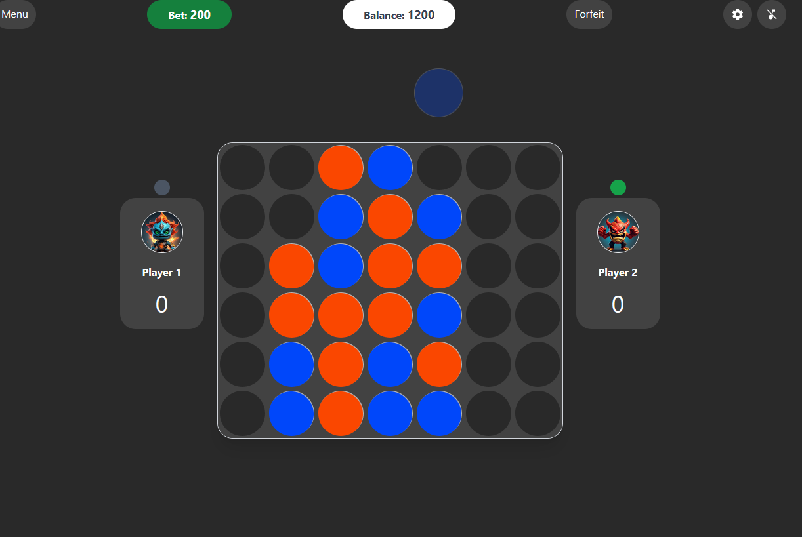

<p align="center">
  <a href="" rel="noopener">
 </a>
</p>

<h3 align="center">Connect 4 Built with NextJS </h3></h3>


## 📝 Table of Contents

- [About](#about)
- [Getting Started](#getting_started)
- [Deployment](#deployment)
- [Usage](#usage)
- [Built Using](#built_using)
- [TODO](../TODO.md)
- [Contributing](../CONTRIBUTING.md)
- [Authors](#authors)
- [Acknowledgments](#acknowledgement)

## 🧐 About <a name = "about"></a>


### Connect 4 Built with NextJS


### Features

- **Responsive Design**: The site is fully responsive and looks great on all devices, from mobile phones to desktop computers.
- **Modern UI/UX**: Accurate replication of the iPhone 15's sleek and modern user interface.
- **Interactive Elements**: Includes interactive features such as image sliders, animations, and navigation menus.
- **Accessibility**: Built with accessibility in mind to ensure a seamless experience for all users.
- **Performance Optimization**: Optimized for fast loading times and smooth performance.
- **Music Support**

### Technologies Used

- **HTML5**: For the basic structure and content of the site.
- **CSS3**: For styling and layout, including Flexbox and Grid for responsive design.
- **JavaScript**: For interactivity and dynamic content.
- **TailwindCSS**: To help with responsive design and layout.
- **NextJS**: A React framework for faster production.

This is a [Next.js](https://nextjs.org/) project bootstrapped with [`create-next-app`](https://github.com/vercel/next.js/tree/canary/packages/create-next-app).

## Getting Started <a name = "getting_started">

First, run the development server:

```bash
npm run dev
# or
yarn dev
# or
pnpm dev
# or
bun dev
```

Open [http://localhost:3000](http://localhost:3000) with your browser to see the result.


## Learn More

To learn more about Next.js, take a look at the following resources:

- [Next.js Documentation](https://nextjs.org/docs) - learn about Next.js features and API.
- [Learn Next.js](https://nextjs.org/learn) - an interactive Next.js tutorial.

You can check out [the Next.js GitHub repository](https://github.com/vercel/next.js/) - your feedback and contributions are welcome!

## Deploy on Vercel <a name = "deployment">

The easiest way to deploy your Next.js app is to use the [Vercel Platform](https://vercel.com/new?utm_medium=default-template&filter=next.js&utm_source=create-next-app&utm_campaign=create-next-app-readme) from the creators of Next.js.

Check out our [Next.js deployment documentation](https://nextjs.org/docs/deployment) for more details.


### License

Distributed under the MIT License. See `./LICENSE` for more information.

### Contact

Samuel Oguntimehin - [@samuelOtimehin](https://twitter.com/samuelOtimehin) - oguntimehinsamuel1@gmail.com

Project Link: [Click Here](https://e)


## ⛏️ Built Using <a name = "built_using"></a>

- [NextJS](https://www.nrxtjs.org/) - Web Framework


## ✍️ Authors <a name = "authors"></a>

- [@cybugg](https://github.com/Cybugg/) - Idea & Initial work


## 🎉 Acknowledgements <a name = "acknowledgement"></a>

- Hat tip to anyone whose code was used
- Inspiration
- References
